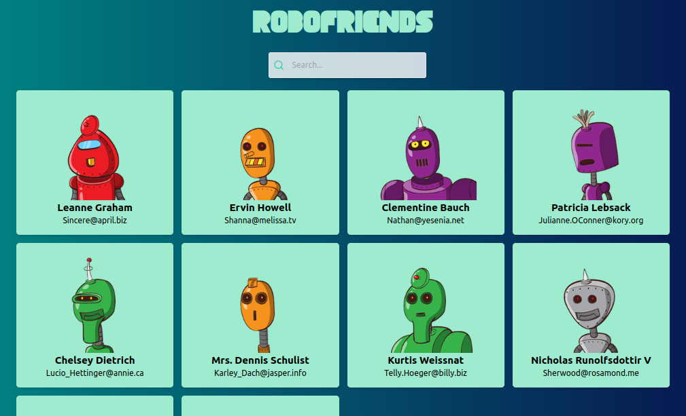

# Robofriends

Robofriends é uma aplicação web desenvolvida com Vite, React, Tailwind CSS e TypeScript. O objetivo do projeto é proporcionar uma experiência prática com vários conceitos e técnicas chave do React.


## Tecnologias Utilizadas

- **Vite**: Para ferramentas de desenvolvimento e build extremamente rápidas.
- **React**: Para construção da interface do usuário.
- **Tailwind CSS**: Para estilização com CSS baseado em utilitários.
- **TypeScript**: Para verificação estática de tipos.

## Destaques do Projeto

### Classe de API

O projeto apresenta uma classe responsável por lidar com chamadas à API. Essa classe encapsula a lógica para buscar dados da API, tornando-a reutilizável e mais fácil de manter.

### Criação de Componentes

O Robofriends envolve a criação de vários componentes reutilizáveis do React. Esses componentes ajudam a dividir a interface do usuário em partes gerenciáveis, cada uma responsável por uma parte específica da UI.

### Mapeamento de Arrays

Um dos principais exercícios neste projeto é a iteração sobre um array de dados dentro de componentes React. Isso envolve o uso de métodos de array do JavaScript, como `map`, para renderizar dinamicamente a interface do usuário baseada nos dados recebidos.

## Funcionalidades

- Exibição de uma lista de "robôs amigos" com informações básicas.
- Busca filtrada de robôs utilizando um campo de pesquisa.
- Estilização responsiva e moderna com Tailwind CSS.

## Estrutura de Arquivos

- **src/**
  - **components/**
    - `Card`:
      - `Card.tsx`: Componente para exibir informações de um único robô.
      - `index.tsx`: Componente para exibir uma lista de componentes Card.
    - `Search`: 
      - `index.tsx`: Componente para o campo de pesquisa.
  - **api/**
    - `api.ts`: Classe para chamadas à API.
  - **index.css**: Arquivo de estilos globais.
  - **index.tsx**: Ponto de entrada da aplicação.

  ## Instruções para Execução

Siga os passos abaixo para executar o projeto localmente.

### Pré-requisitos

Certifique-se de ter o Node.js e o npm (Node Package Manager) instalados no seu sistema. Você pode baixar o Node.js (que inclui o npm) no [site oficial do Node.js](https://nodejs.org/).

### Passo a Passo

1. **Criar o Projeto com Vite**

  Clone o repositório do GitHub para o seu computador local:

   ```bash
   git clone https://github.com/Amiltonxavier/robofrinds.git
   
   cd robofriends 
   ```
2. Instale as dependências do projeto:

```bash
  npm install
```

3. Execute a aplicação em desenvolvimento:

```bash
    npm run dev
```
